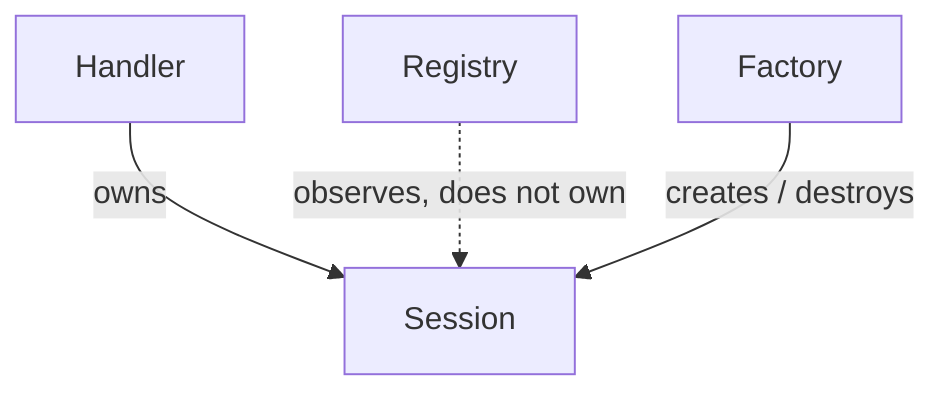

# Write Technical Documentation

Documentation that describes code inaccurately is worse than none: it misleads readers who trust it. The core discipline of this skill is that every claim must be grounded in the actual source, and anything not verified is marked as such rather than invented.

## Operating principle

Read before you write. Never document a component from its name, from convention, or from what a class "probably" does. Open the files, read the declarations and the call sites, and describe what is actually there. If you cannot verify a claim, either leave it out or flag it explicitly ("assumption: ...", "unverified: ...").

This matches the collaboration default of most repositories: the user reviews and owns the result, so accuracy and traceability matter more than volume. Prefer a shorter document you are sure of over a long one padded with plausible guesses.

## Workflow

1. **Scope the request.** Determine what is being documented and at what level: a single class/file, one module/component, a whole subsystem, the build/dependencies, or the top-level project. Ask only if the scope is fundamentally ambiguous; otherwise pick the most useful interpretation and state it.

2. **Locate the sources.** Find the relevant files. For a module, that means its interfaces/headers, implementation files, and its build or package config (whatever the stack uses: CMakeLists.txt, .csproj, package.json, pyproject.toml, go.mod, Cargo.toml, and so on). For architecture, that means the entry point, the module boundaries, and how they wire together.

3. **Read them.** Extract:
   - public interface (types, functions, methods, their signatures and contracts)
   - relationships (what owns/uses/depends on what, inheritance, composition)
   - lifetime and ownership where the language makes it relevant (smart pointers/RAII, factories, singletons, disposal, connection/resource handles)
   - dependencies (external libraries, other internal modules, and how they are pulled in)
   - build and run requirements (build tool, language/runtime version, flags, environment, working-directory needs)

4. **Write the document** using the templates below. Describe the current state, not aspirational design. If something is wired up but unused, or is a practice sandbox with no production purpose, say so plainly rather than dressing it up.

5. **Mark the uncertain.** Anything inferred rather than read gets an explicit flag. Anything you could not find gets a "not found in source" note rather than a fabricated answer.

## Grounding rules

- Quote real identifiers exactly as they appear in the source, not paraphrased approximations. If the code calls it `UserSession::refresh`, do not write "the session refresher".
- When you state a relationship, it should be traceable to something in the code. "Component A observes B's lifetime without owning it" is a claim you can back only if you have seen the weak reference (or equivalent) that makes it true. If you cannot point to the evidence, do not assert it.
- Do not invent function names, flags, file paths, or version numbers. If you need one and cannot find it, write `<unknown>` and note it.
- Distinguish "is" from "should be". Describe behavior; only prescribe when the user asked for recommendations.
- If files are practice/exercise code with no shared purpose, do not manufacture a unifying narrative between them.

## Document templates

Pick the template matching the scope. Adapt headings to fit; these are defaults, not a straitjacket.

### Module / component documentation

```markdown
# <Module name>

## Purpose
One or two sentences: what this module is and what problem it addresses. State if it is a sandbox/exercise rather than production code.

## Public interface
The types and functions a caller uses, with signatures and a one-line contract each.

## Internal design
Key types and how they relate (ownership, inheritance, composition, factories). Note lifetime, state, or resource-management patterns where they matter.

## Dependencies
What it needs: external libraries, other internal modules, and language/standard requirements.

## Usage
A minimal, real example of calling into it. Note any preconditions (files that must be present, initialization order).

## Notes / caveats
Known limitations, unused wiring, things a reader would trip over. Flag anything unverified.
```

### System / architecture documentation

```markdown
# Architecture: <system name>

## Overview
What the system is and its top-level shape (one paragraph). List the major components.

## Components
For each component: its responsibility and its boundary (what it owns vs. what it only observes/uses).

## How components relate
The wiring: who calls whom, who owns whom, data/control flow. A diagram helps if relationships are non-trivial.

## Build and layout
How the pieces are built and where outputs land. Toolchain and version requirements, and any per-target or per-package quirks.

## Cross-cutting concerns
Concerns spanning components: error handling, memory safety, concurrency, logging, testing.

## Open questions / unverified
Anything inferred rather than confirmed from source.
```

### Dependency / build documentation

```markdown
# Build and dependencies

## Requirements
Toolchain, language standard, minimum versions, per-platform notes.

## External dependencies
Each dependency: name, how it is pulled in (FetchContent, package manager, vendored), and whether it is actually used.

## Build steps
The exact commands, per platform where they differ. Where outputs land.

## Run requirements
Working-directory assumptions, required data files, environment.

## Platform-specific notes
Anything that differs by OS, runtime, or toolchain, with the reason.
```

## Diagrams

Use a diagram when relationships are hard to follow in prose (ownership graphs, call flow, layered architecture). Prefer a text-based format the user can keep in the repo, such as a Mermaid block in the Markdown:

```markdown

```

Keep diagrams grounded in the same rule: every node and edge must correspond to something real in the code.

## Style

- Concise and direct. No filler, no marketing tone.
- Imperative and factual for descriptions of behavior.
- Use the reader's likely entry point: start from why they would open this file, then the interface, then the internals.
- Match existing repo conventions (file names like `ARCHITECTURE.md`, `README.md`, `<Module>/README.md`) rather than imposing new ones.
- Do not use em dashes.

## Examples

**Example 1: grounded vs. guessed**
Guessed: "The cache manages the lifecycle of every connection in the pool."
Grounded: "The cache holds a weak reference to each open connection, so it can look one up without keeping it alive; ownership stays with the pool that created it. (Verified: the field is a weak/non-owning handle, and the pool holds the strong reference.)"

**Example 2: flagging the unverified**
"The service is deployed behind the API gateway. The active route set is defined in `routes.config`, not in the handler filenames (unverified whether legacy routes remain registered elsewhere; only `routes.config` was read)."

**Example 3: not inventing a narrative**
Wrong: "These three modules form a pipeline that ingests, transforms, and exports data."
Right: "These three modules are independent and share no call path; each is a separate utility. A change in one is not assumed to affect the others unless a dependency is shown."
